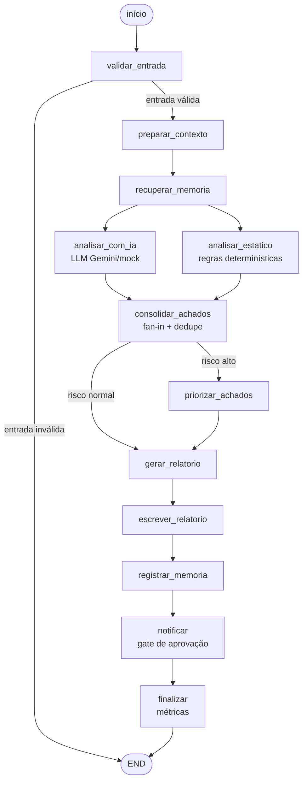

# Agente Revisor de Código (LangGraph + Gemini)

Agente de IA que automatiza a **revisão de código-fonte**. Recebe um arquivo de
código, analisa em busca de problemas (bugs, segurança, performance e estilo)
combinando **análise por IA** (Google Gemini) e **regras determinísticas**, e
produz um **relatório estruturado em Markdown** com severidade, localização e
sugestão para cada problema — além de notificar um canal externo quando o risco
é alto.

Projeto Avaliativo — **Módulo 2 (M2.2)**, disciplina *IA para Desenvolvedores*.

> **Vídeo de demonstração (YouTube, não listado):** _adicionar o link aqui_

---

## 1. Descrição da solução

- **Problema:** revisar código manualmente é lento e sujeito a esquecimentos.
  O agente faz uma primeira triagem consistente, priorizando o que é mais
  crítico e mantendo rastreabilidade da execução.
- **Público:** desenvolvedores, QA e SRE que querem uma revisão automatizada
  como apoio ao code review.
- **Entrada:** o caminho de um arquivo de código (`.py`, `.js`, `.java`, etc.).
- **Saída:** relatório Markdown em `reports/`, resumo no terminal, notificação
  opcional no Discord e sinais de observabilidade (logs + métricas).
- **Valor:** triagem rápida e explicável, com governança (aprovação humana para
  ações externas) e evidências para auditoria.

### Continuidade do mini-projeto (M2.1)

Este projeto **evolui** o mini-projeto do módulo. Foram **mantidos** o núcleo do
grafo LangGraph, as ferramentas de arquivo e o fallback mock. Foram
**refatorados/adicionados**: paralelização e nova ramificação condicional no
grafo, tool externa (webhook), memória persistente, governança e defesa contra
prompt injection, observabilidade, QA com IA e pipeline de CI.

## 2. Classificação e arquitetura

**Classificação: sistema híbrido.** Combina decisões de um **agente** (análise
por LLM) com um **workflow determinístico** (regras estáticas, política de
autonomia e roteamento explícito do grafo). A separação entre o que o modelo
decide e o que é regra fixa é mantida de forma clara.

Fluxo principal (LangGraph `StateGraph`):



Características cobertas: **estado tipado**, execução **sequencial**, **duas
ramificações condicionais** (validação e risco), **paralelização** (análise IA
e estática em paralelo com fan-in) e **condição de parada**.

## 3. Tool e integração

Além das duas ferramentas locais de arquivo (leitura com validação de
extensão/tamanho e escrita com proteção anti *path traversal*, em
`src/tools.py`), a solução integra uma **tool externa por webhook**
(`src/notificacao.py`):

- Envia o resumo da revisão para um **webhook do Discord**.
- **Validação de schema** com Pydantic antes de enviar.
- **Proteção anti-SSRF:** só aceita webhooks HTTPS de hosts do Discord.
- **Resiliência:** `timeout` e `retry` limitado (backoff), com *skip* gracioso
  quando o webhook não está configurado.

## 4. Contexto e memória

Duas camadas de memória:

- **Estado compartilhado** (`src/state.py`) — memória de curto prazo da
  execução: código lido, metadados, achados, `run_id`, etc.
- **Histórico persistente** (`src/memoria.py`) — `data/historico.jsonl`
  (armazenamento persistente). A cada revisão o resultado é gravado; na próxima
  revisão do **mesmo arquivo**, o agente **recupera a anterior** e mostra no
  relatório o que mudou (delta de achados e mudança de risco). Esse histórico
  também alimenta a estimativa de tendência/risco (ver seção 7).

## 5. Segurança e autonomia

- **Segredos fora do repositório:** chave do Gemini e URL do webhook vêm apenas
  de variáveis de ambiente; `.env` está no `.gitignore` (só o `.env.example` é
  versionado).
- **Política de autonomia** (`src/policy.py`): ações classificadas em
  *automático*, *aprovação* ou *bloqueado*. A notificação externa exige
  **aprovação humana** quando o risco é alto; hosts fora do Discord são
  bloqueados.
- **Aprovação humana (human-in-the-loop):** com risco alto e sem aprovação, o
  envio externo fica em `aguardando_aprovacao` e só ocorre após confirmação na
  CLI (`--aprovar`); o padrão seguro é **não enviar**.
- **Defesa contra prompt injection:** o prompt trata o código como *dado* (não
  instrução) e nunca revela segredos; uma regra determinística sinaliza
  tentativas de injeção como achado de segurança — defesa em profundidade.
  Evidência: `docs/evidencias/prompt-injection.md`.

## 6. Instalação e execução

Pré-requisitos: **Python 3.10+** (desenvolvido em 3.12).

```bash
# 1. Ambiente virtual
python3 -m venv .venv
source .venv/bin/activate          # Windows: .venv\Scripts\activate

# 2. Dependências
pip install -r requirements.txt

# 3. Configuração (opcional) — copie e preencha
cp .env.example .env
```

Variáveis de ambiente (`.env.example`):

| Variável | Descrição |
|----------|-----------|
| `GOOGLE_API_KEY` | Chave do Google Gemini. Sem ela, o agente roda em **modo mock**. |
| `GEMINI_MODEL` | (Opcional) Modelo do Gemini. Padrão: `gemini-3.6-flash`. |
| `DISCORD_WEBHOOK_URL` | (Opcional) Webhook para notificação. Sem ela, a etapa é pulada. |

Execução:

```bash
# revisão de um arquivo
python run_review.py examples/exemplo_com_bugs.py

# pré-aprovar o envio externo (não interativo)
python run_review.py examples/exemplo_com_bugs.py --aprovar
```

Testes e lint:

```bash
pytest              # 44 testes (unitários + integração + E2E)
ruff check src tests
```

## 7. QA, observabilidade e DevOps

- **Testes:** unitários (`validation`, `tools`), de **integração** (fluxo do
  grafo) e **E2E** (`tests/test_e2e.py`), todos herméticos (mock, sem rede).
- **Code review com IA:** o próprio agente revisa código real do projeto
  (*dogfooding*) e a revisão assistida por IA foi usada em alterações reais —
  ver `docs/qa/code-review-ia.md` e a priorização por risco em
  `docs/qa/priorizacao-risco.md`.
- **Observabilidade (dois sinais correlacionados por `run_id`):** logs
  estruturados em `logs/agent.jsonl` e métricas de latência em
  `logs/metricas.jsonl`. Investigação em `docs/evidencias/observabilidade.md`.
- **Resiliência:** `timeout`/`retry`/`fallback` no LLM e na notificação.
- **Pipeline CI** (`.github/workflows/ci.yml`): **lint** (ruff) + **testes**
  (pytest) + **build** (compileall/import).
- **Anomalia e risco:** `run_devops_analysis.py` usa IA para explicar os logs de
  duas etapas do CI, detecta a anomalia de latência do nó de IA e estima o risco
  a partir do histórico. Evidências em `docs/qa/analise-logs-ia.md` e
  `docs/qa/anomalia-e-risco.md`.

## 8. Cenários de uso

**Cenário 1 — fluxo principal (arquivo com bugs).**
Entrada: `examples/exemplo_com_bugs.py`. Comportamento: o agente detecta
credencial fixa, `eval`, `except` genérico, etc.; classifica **risco alto**;
gera o relatório e, com aprovação, notifica o Discord.

```
🐛 Problemas encontrados: 6 (IA=6, estática=0)
⚠️  Nível de risco: ALTO — recomenda-se revisão humana.
✅ Relatório salvo em: reports/review-exemplo_com_bugs-*.md
```

**Cenário 2 — risco/adversarial (prompt injection).**
Entrada: `examples/exemplo_prompt_injection.py`, com instruções maliciosas em
comentários. Comportamento esperado: o agente **reporta** as tentativas como
problema de segurança (não obedece), **não vaza** o segredo do arquivo e
**bloqueia** o envio externo por falta de aprovação. Evidência:
`docs/evidencias/prompt-injection.md`.

## 9. Análise crítica, refinamento e limitações

- **Refinamento documentado** (problema → alteração → resultado):
  `docs/refinamento.md`. Destaque: o Gemini caía sempre no fallback; a
  investigação revelou modelo descontinuado + mudança no formato da resposta; a
  correção tornou o modelo configurável e normalizou a resposta, restaurando a
  análise real por IA e fortalecendo a defesa contra injeção.
- **Limitações:**
  - A chamada ao Gemini está lenta neste endpoint (~1 min) — anomalia conhecida,
    mitigada por timeout/fallback e monitorada.
  - Revisa um arquivo por vez (não percorre diretórios).
  - Não executa o código analisado (revisão estática).
  - O modo mock detecta apenas padrões simples.
- **Evoluções futuras:** cache por hash de arquivo, revisão de diffs/PRs,
  execução assíncrona e um endpoint HTTP para integração com outros serviços.

---

## Estrutura do projeto

```
agente-revisor-codigo/
├── run_review.py              # CLI principal
├── run_devops_analysis.py     # análise de DevOps (logs/anomalia/risco)
├── requirements.txt
├── pyproject.toml             # configuração do ruff (lint)
├── conftest.py                # fixture de isolamento dos testes
├── .env.example               # nomes das variáveis (sem valores)
├── .github/workflows/ci.yml   # pipeline CI (lint + testes + build)
├── src/
│   ├── state.py               # estado compartilhado (memória curta)
│   ├── tools.py               # ferramentas de arquivo
│   ├── notificacao.py         # tool externa (webhook Discord)
│   ├── memoria.py             # histórico persistente (memória longa)
│   ├── policy.py              # política de autonomia
│   ├── observability.py       # logs estruturados + métricas
│   ├── devops.py              # anomalia + estimativa de risco
│   ├── llm.py                 # Gemini + fallback mock
│   ├── analise_estatica.py    # regras determinísticas + prompt injection
│   ├── validation.py          # validação de entrada e saída
│   ├── nodes.py               # nós do grafo
│   ├── agent.py               # montagem do StateGraph
│   └── prompts/revisao_codigo.md
├── examples/
│   ├── exemplo_com_bugs.py
│   └── exemplo_prompt_injection.py
├── tests/                     # unitários + integração + E2E
├── docs/
│   ├── refinamento.md
│   ├── qa/                    # code review IA, priorização, logs, anomalia/risco
│   └── evidencias/            # prompt injection, observabilidade
├── data/                      # histórico (runtime, não versionado)
├── logs/                      # logs e métricas (runtime, não versionado)
└── reports/                   # relatórios (runtime, não versionado)
```

## Prompts e modelo

As instruções de sistema do agente estão em `src/prompts/revisao_codigo.md` (com
as regras de segurança contra injeção). O modelo é configurável por
`GEMINI_MODEL`. Prompts usados no desenvolvimento: `docs/prompts.md`.
